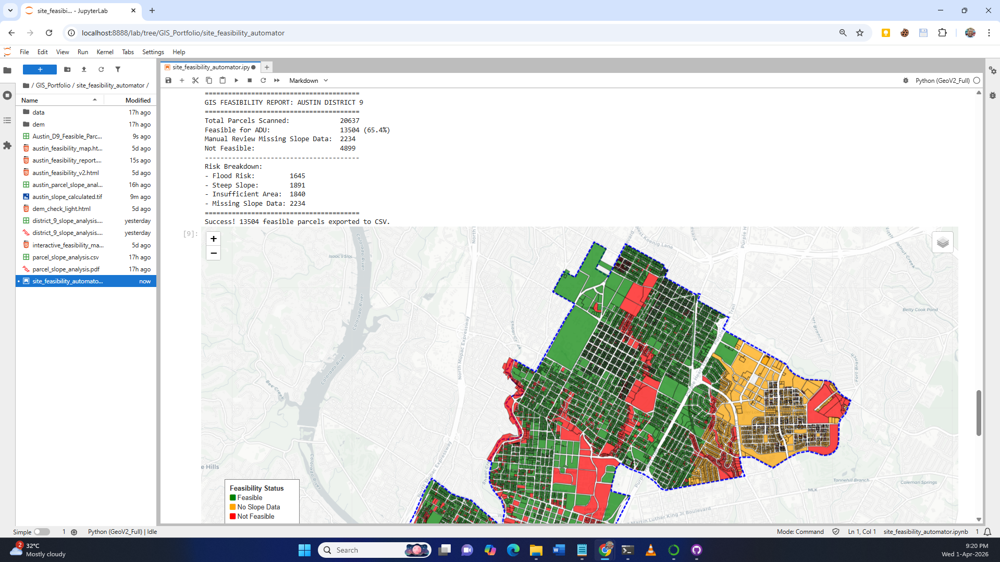
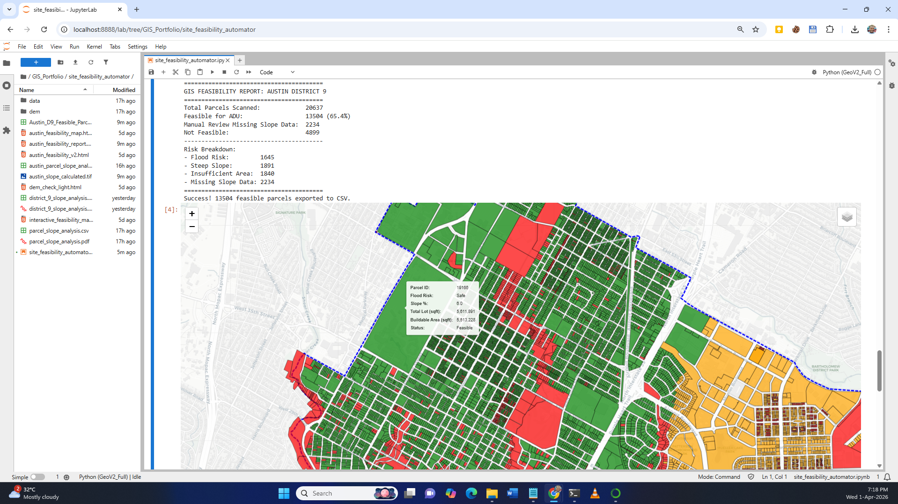

# 🌍 Austin, TX: Automated Land Feasibility & Risk Scanner

### **Bridging Geological Engineering with GIS Automation**

This project demonstrates an automated pipeline for identifying "ready-to-build" residential parcels in **Austin, TX (District 9)**. By combining **Python (GeoPandas)**, **PostGIS**, and **Raster Terrain Analysis**, the tool screens over 50,000+ parcels for environmental hazards and engineering constraints in seconds.

---

## **📍 The Problem: Manual Site Scouting is Slow**
Real estate developers and city planners often spend hundreds of hours manually checking zoning and terrain for individual parcels. This tool automates that workflow, filtering out unviable land based on physical and legal constraints before a human ever sets foot on site.

---

## **🏗️ Engineering Logic & Methodology**

### **Visualizing the Analysis**

| **Regional Site Screening** | **Granular Parcel Constraints** |
| :---: | :---: |
|  |  |
| *Automated screening across Council District 9* | *Interactive tooltips showing slope and flood risk* |

As a **Geological Engineer**, I built this scanner to look beyond simple zoning. The tool evaluates every parcel against three "Deal-Breaker" criteria:

1.  **Flood Risk (FEMA Data)**: Programmatic intersection with floodplains using **PostGIS** spatial joins.
2.  **Slope Stability (Terrain Analysis)**: Calculation of slope percentage using **Digital Elevation Models (DEM)**. Any parcel with a **slope > 15%** is flagged as "Unstable" due to high foundation costs and erosion risk.
3.  **Geometric Feasibility**: Automated generation of **10ft internal setbacks** to calculate the true "Buildable Envelope." Parcels with < 400 sq. ft. of usable area are excluded.

---

## **🛠️ Tech Stack**

| Category | Tools |
| :--- | :--- |
| **Language** | Python (Pandas, GeoPandas, NumPy) |
| **Spatial Database** | PostgreSQL + PostGIS |
| **Raster Analysis** | Rasterio, RichDEM (DEM Processing) |
| **Visualization** | Folium (Interactive Web Maps) |
| **Data Source** | City of Austin Open Data Portal (API) |

---

## **📊 Key Deliverables**
*   **[Live Interactive Map](https://joshuaafenyo.github.io/austin-gis-feasibility/)**: A web-ready dashboard for stakeholders to inspect parcel-level data.
*   **Cleaned Lead List (CSV)**: A filtered list of "Green Light" parcels ready for acquisition teams.
*   **PostGIS Integration**: A scalable database schema for high-speed spatial queries.

---

## **🚀 Hire an Engineer for your GIS Needs**
I specialize in building automated spatial tools that solve real-world land-use problems. 

**Looking to automate your site-scouting workflow?**  
👉 **[View my Upwork Profile](https://www.upwork.com/freelancers/~01f542b05fb153418a)**  
👉 **Email**: [mrjoaf@gmail.com]

---

### **How to Use:**
1.  Clone the repository.
2.  Run the `Austin_Feasibility_Analysis.ipynb` notebook.
3.  The interactive map will be saved as `austin_feasibility_report.html`.
